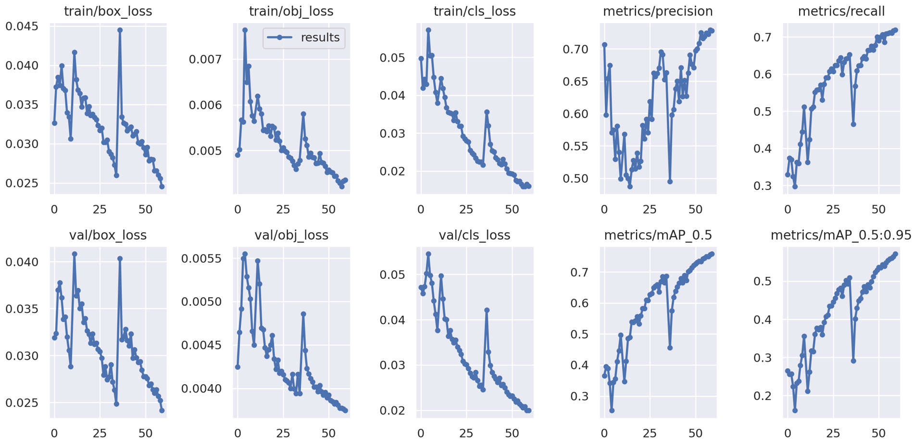
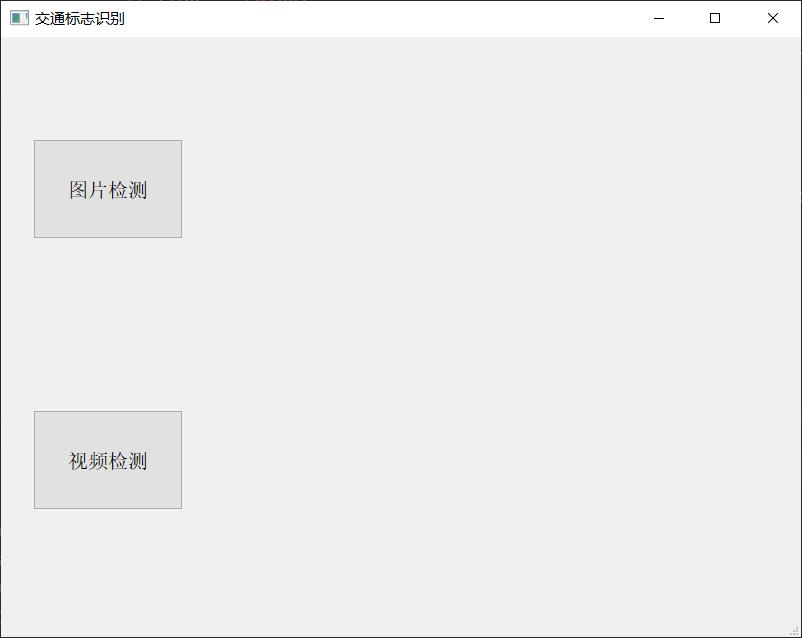
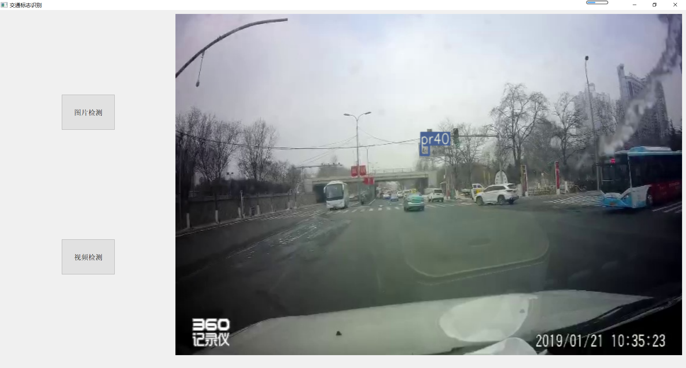

# 基于YOLOv5的交通标志识别系统-TT100K

使用的数据集为[TT100K](http://cg.cs.tsinghua.edu.cn/traffic-sign/data_model_code/data.zip)。由于原始数据集较大，且分类数量较多，因此选取了分类数量最多的45类数据进行训练。

# 实验环境

- Ubuntu18.04 / Windows 10
- CUDA 10.1 cudnn7.6.1
- Python 3.8.2 PyTorch 1.8.1
- YOLOv5 6.0

# 使用说明

下载[TT100K数据集](http://cg.cs.tsinghua.edu.cn/traffic-sign/data_model_code/data.zip),并下载相应的45分类的json文件，然后使用convert_data.py将其转换，得到划分好的数据集。最后进行训练。

# 训练结果

# 使用PyQt5进行可视化展示

详细说明可见博客：[基于YOLOv5的交通标志识别系统-TT100k](https://editor.csdn.net/md/?articleId=130771066)
